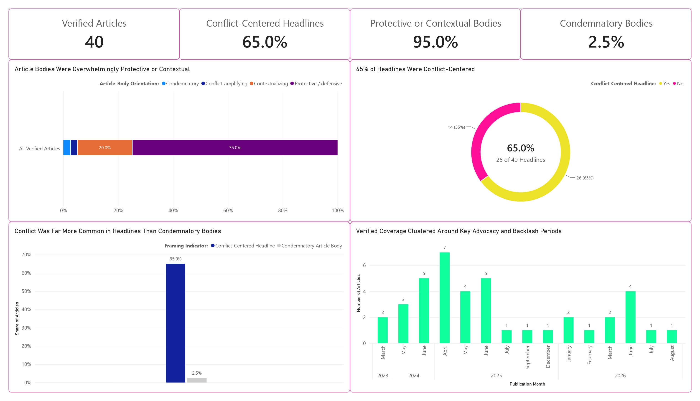
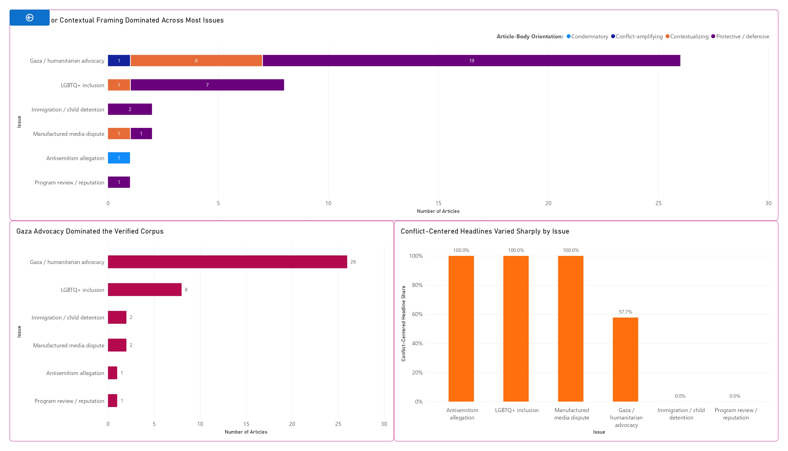
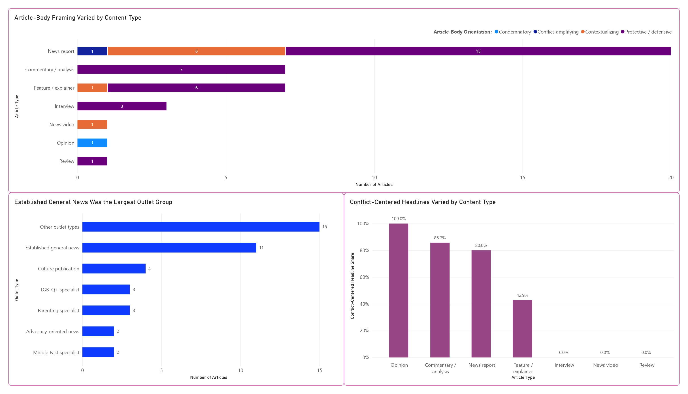
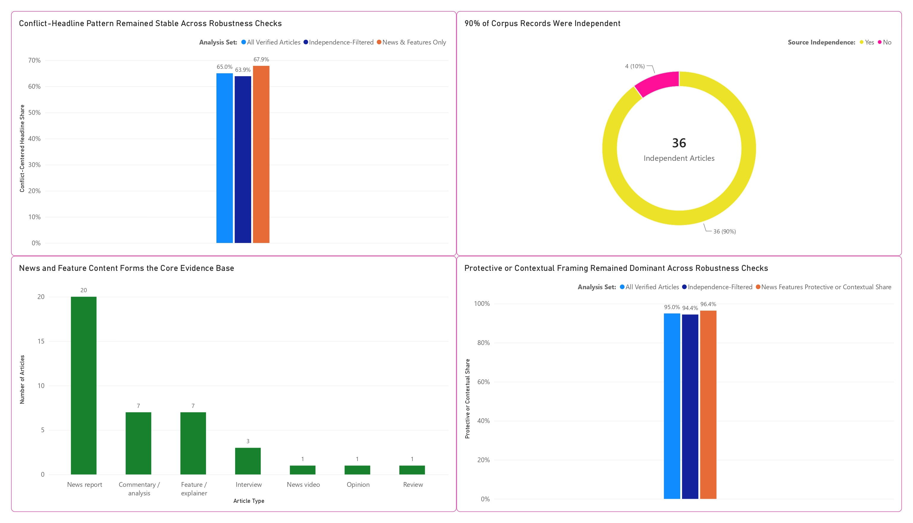

# 📰 Conflict in the Headline, Context in the Story

## A Media-Framing Analysis of Ms. Rachel's Social Advocacy

A Power BI media-framing analysis of **40 verified, publicly accessible articles** examining how headlines and full articles presented Ms. Rachel's social advocacy between March 2023 and August 2026.

---

## 🔎 Overview

Ms. Rachel has received significant media attention for speaking publicly about social issues, particularly her advocacy for children affected by the war in Gaza and her support for LGBTQ+ inclusion.

Some of that coverage has been built around backlash, accusations, and controversy.

**But does the same tone continue beyond the headline?**

This project examines that question by analyzing headlines separately from the articles themselves.

### The central finding

> **The controversy was often in the headline. The context came afterward.**

Of the 40 verified articles:

- **65.0%** had headlines centered on conflict, backlash, accusations, or controversy.
- **95.0%** of the articles themselves were protective of Ms. Rachel or provided context around the criticism.
- Only **1 of 40 articles (2.5%)** was clearly condemnatory.

Most of the sampled articles were therefore **not attacking Ms. Rachel**, even when their headlines prominently featured the controversy surrounding her.

---

## 🎯 Research Question

**How has publicly accessible media coverage presented Ms. Rachel when reporting on her social advocacy?**

Rather than classifying each article as simply positive or negative, the analysis separates two dimensions:

- **Headline framing:** whether conflict, backlash, accusations, controversy, or another point of tension was given prominence.
- **Article-body orientation:** how the full article ultimately presented Ms. Rachel and the issue being discussed.

This distinction captures something that a simple sentiment score could easily miss:

> **A story can sound confrontational at first glance without ultimately being hostile to the person it covers.**

---

# 📊 Dashboard Preview

## Dashboard 1: Executive Overview

The headline-body gap is the clearest finding in the analysis.

- **40** verified articles
- **65.0%** conflict-centered headlines
- **95.0%** protective or contextual article bodies
- **2.5%** condemnatory article bodies

Conflict was common in the headlines. Condemnation was not.

---

## Dashboard 2: Framing by Issue

Gaza and humanitarian advocacy dominated the dataset, accounting for **26 of the 40 articles**.

LGBTQ+ inclusion showed an especially clear headline-body contrast. All **8 articles** in this category had conflict-centered headlines, yet **7 article bodies were protective and 1 was contextualizing**.

The result highlights why percentages need to be interpreted alongside article volume. Several smaller categories also reached 100% conflict-centered headlines, but some were based on only one or two articles.

---

## Dashboard 3: Outlet & Article Type

News reports formed the largest content group, with **20 articles**.

Although **80.0% of news-report headlines** were conflict-centered, none of the 20 article bodies was condemnatory.

A similar contrast appeared in commentary and analysis content. **85.7% of those headlines** were conflict-centered, while all seven article bodies were protective.

Across several types of content, headlines were more likely to foreground conflict than the articles themselves were to condemn Ms. Rachel.

---

## Dashboard 4: Evidence & Robustness

The main finding remained stable when the dataset was tested under stricter conditions.

| Analysis | Conflict-Centered Headlines | Protective / Contextual Bodies |
|---|---:|---:|
| All 40 verified articles | **65.0%** | **95.0%** |
| 36 independent articles | **63.9%** | **94.4%** |
| 28 news & feature articles | **67.9%** | **96.4%** |

Removing related or syndicated coverage did not substantially change the result. The same was true when the analysis was restricted to news and feature content.

This suggests that the headline-body gap was not being driven by a small number of syndicated or commentary articles.

---

# 💡 Key Insights

### 1. Conflict was common. Condemnation was not.

Almost two-thirds of the sampled headlines foregrounded conflict, while only **one article in the entire dataset** was clearly condemnatory.

### 2. Headlines and full articles often told different stories.

A headline centered on backlash or accusations did not necessarily mean that the article itself was hostile toward Ms. Rachel.

### 3. Gaza dominated the volume of coverage.

Gaza and humanitarian advocacy accounted for **65% of the verified dataset**, making it the largest issue group in the analysis.

### 4. LGBTQ+ coverage showed a particularly clear headline-body gap.

All eight LGBTQ+ headlines were conflict-centered, while every article body was either protective or contextual.

### 5. The finding remained stable under stricter tests.

Removing related or syndicated coverage and focusing only on news and feature content produced very similar results.

---

# 🧠 What Do the Findings Mean?

The evidence does **not** support the conclusion that the sampled media coverage broadly condemned Ms. Rachel.

Instead, the analysis points to a more specific pattern:

> **Conflict frequently served as the entry point to a story, even when the reporting itself was protective or explanatory.**

A headline may tell readers that Ms. Rachel is facing backlash, accusations, or controversy. The article itself may then challenge the criticism, provide additional context, include her response, or present information that supports her position.

The headline is therefore not necessarily inaccurate. However, it may emphasize a different part of the story from the article as a whole.

This analysis does not establish that these headlines were clickbait or deliberately misleading. Editorial intent, click-through rates, audience response, and social-media behavior were not measured.

What can be observed is the difference between **how the story was introduced and what the article ultimately communicated**.

---

# 🔬 Methodology

The analysis uses a **purposive sample of 40 unique, publicly accessible media articles** published between March 2023 and August 2026.

Each article was reviewed and coded across several fields, including:

- Publication date
- Outlet and outlet type
- Article type
- Issue or topic
- Headline framing
- Article-body orientation
- Presence of Ms. Rachel's perspective
- Attribution of criticism
- Qualification or challenge of claims
- Original or syndicated status
- Source independence

### Article-body orientation

Articles were classified as:

- **Protective / defensive** – largely defended Ms. Rachel, challenged criticism, or presented information supportive of her position.
- **Contextualizing** – primarily explained the situation and provided context without taking a strongly protective or condemnatory position.
- **Conflict-amplifying** – gave greater prominence to the dispute or criticism without becoming clearly condemnatory.
- **Condemnatory** – clearly presented Ms. Rachel or her actions negatively.

Headline conflict was assessed **separately** from article-body orientation.

Related or syndicated records were also flagged, allowing the main findings to be tested without those records.

---

# ⚠️ Limitations

This project analyzes a **purposive public-media sample**, not a census of every article published about Ms. Rachel.

The findings describe patterns within the collected dataset and cannot establish:

- Editorial intent behind individual headlines
- Whether headlines were deliberately written as clickbait
- Causal effects on audience opinion
- Follower or unfollower behavior
- Political identity of every critic
- Whether the findings represent all media organizations

Percentages based on small issue or content groups should also be interpreted alongside their underlying article counts.

These limitations define how far the findings can reasonably be taken rather than invalidating the patterns observed in the dataset.

---

# 🛠️ Tools Used

### Data Preparation & Analysis
- Microsoft Excel
- Power Query
- Manual content analysis

### Data Modeling
- Power BI
- DAX

### Visualization & Reporting
- Power BI
- Microsoft Excel

---

# 📁 Project Files

### 📊 Dashboard
Four Power BI dashboard views covering:
- Executive overview
- Framing by issue
- Outlet and article type
- Evidence and robustness

### 📗 Cleaned & Coded Dataset
[`Ms_Rachel_Content_Sample_Register_v2.0.xlsx`](Ms_Rachel_Content_Sample_Register_v2.0.xlsx)

Contains the verified 40-article dataset, coding variables, source URLs, analytical flags, and Power BI-ready fields used in the analysis.

### 📄 Full Analysis Report
[`Ms_Rachel_Media_Framing_Analysis_Report.pdf`](Ms_Rachel_Media_Framing_Analysis_Report.pdf)

Contains the full findings, methodology, interpretation, limitations, and supporting dashboard analysis.

---

# 🔑 Key Takeaway

> **The controversy was often in the headline. The context came afterward.**

Within the 40-article verified sample, conflict was a common way to introduce stories about Ms. Rachel's advocacy, but it rarely translated into outright condemnation in the articles themselves.

The project demonstrates why media analysis benefits from looking beyond headline sentiment and examining the substance of the reporting.

**Conflict was common. Condemnation was not.**

---

*This portfolio project analyzes publicly accessible media content for research and educational purposes. Findings describe patterns within the collected sample and should not be interpreted as representative of all media coverage or as evidence of causal effects on audience behavior.*
